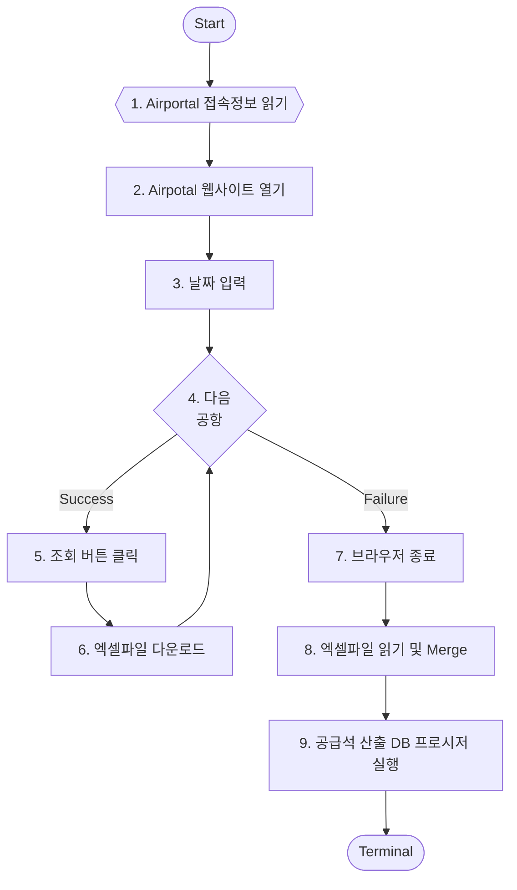

# RPA-002 수송이력

## 개요

- 요청부서: 경영계획팀
- 실행형태: Web
- 시작일: -1 Days
- 종료일: 시작일과 동일
- RPA ID: RPA-002
- 수행시간: 

## 공용 리소스

### Module

- OpenBrowser: /Browser/BrowserControl.custom
- TerminalBrowser: /Browser/BrowserControl.custom
- Export_Module: /2.1/ExportModule.custom
- Notice_Module: /2.1/NoticeModule.custom
- SaveAs_Chrome: /Chrome/SaveAsPopup.custom

## 소스 데이터

- 없음

## 결과 데이터

- 작업 결과 데이터 (OutputTable)
  - Email Notice 본문에 출력
- 공항별 수송 이력 데이터 (OutputTable2)
  - DB Export
  - Table: TB_RPA_OPERATION
  - 과거 데이터 누적

## 프로세스

1. airportal 접속 정보 얻기

2. 브라우저를 통해 웹사이트 열기 (`OpenBrowser` 모듈)

   - 로그인 및 로그인 성공 체크
   - 로그인 후 처음 오픈한 페이지로 redirect

3. 날짜 입력

   - 사이트 리뉴얼 이후 D-14일 이전 데이터만 제공
   - 시작일, 종료일을 동일하게 하여 하루치 데이터씩 조회
   - Date Range인 경우 날짜별로 반복 실행

4. select 박스를 순차적으로 선택

   - options[n].selected = true로 설정
   - n은 0부터 순차적으로 증가
   - 선택 실패 시 loop break

5. 조회 버튼 클릭

6. 엑셀파일 다운로드 (`SaveAs_Chrome` 모듈)

   - 정해진 패턴대로 미리 파일명을 생성하고 다른이름으로 저장
   - 이미 파일이 있는 경우 덮어쓰기 동작
   - 날짜 / 공항 / 파일경로를 OutputTable에 저장

7. 브라우저 종료 (`Terminal Browser` 모듈)

8. 엑셀파일 읽기 및 Merge

   - sum 데이터를 OutputTable에 업데이트
   - raw 데이터는 OutputTable2에 Merge

9. 운송실적 데이터에 전체 공급석 데이터 업데이트

   - RPA.AIRPORTAL_ROUTE_UPDATE_MANUAL(:p_date)

   - DB 프로시저 호출은 Export와 유사한 기능으로 파라미터를 Bulk로 입력 가능
   - 즉 p_date에 날짜데이터를 string[] 으로 입력하여 한번에 실행 가능