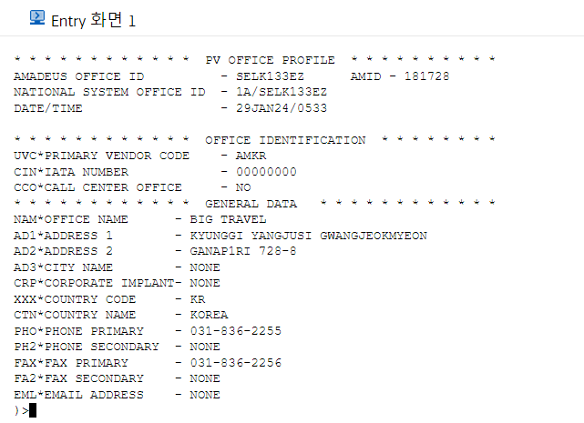

# [RPA-035] HX PNR

## 개요

- 부서: Tariff그룹
- 설명: 1A(Amadeus)에서 GDS HX(CNXL) PNR들을 조회하여 대리점별로 분리된 엑셀 파일로 출력한다.


## 업무 설명

### 대리점 정보 조회

- 1A Entry: PV

```
# PV/<Office ID|IATA Number>/<Options>
> PV/SELK133EZ/O,G
```

- Options (콤마로 구분)
  - O: Office Identification
  - G: General Data

- 결과화면



- 결과 (텍스트)

```
* * * * * * * * * * * *  PV OFFICE PROFILE  * * * * * * * * * *                 
AMADEUS OFFICE ID          - SELK133EZ      AMID - 181728                       
NATIONAL SYSTEM OFFICE ID  - 1A/SELK133EZ                                       
DATE/TIME                  - 29JAN24/0533                                       
                                                                                
* * * * * * * * * * * *  OFFICE IDENTIFICATION  * * * * * * * *                 
UVC*PRIMARY VENDOR CODE    - AMKR                                               
CIN*IATA NUMBER            - 00000000                                           
CCO*CALL CENTER OFFICE     - NO                                                 
* * * * * * * * * * * *  GENERAL DATA   * * * * * * * * * * * *                 
NAM*OFFICE NAME      - BIG TRAVEL                                               
AD1*ADDRESS 1        - KYUNGGI YANGJUSI GWANGJEOKMYEON                          
AD2*ADDRESS 2        - GANAP1RI 728-8                                           
AD3*CITY NAME        - NONE                                                     
CRP*CORPORATE IMPLANT- NONE                                                     
XXX*COUNTRY CODE     - KR                                                       
CTN*COUNTRY NAME     - KOREA                                                    
PHO*PHONE PRIMARY    - 031-836-2255                                             
PH2*PHONE SECONDARY  - NONE                                                     
FAX*FAX PRIMARY      - 031-836-2256                                             
FA2*FAX SECONDARY    - NONE                                                     
EML*EMAIL ADDRESS    - NONE                                                     
)>
```

